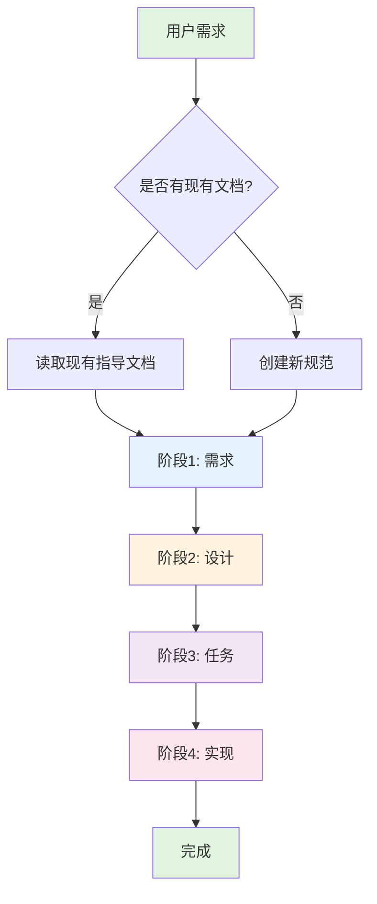
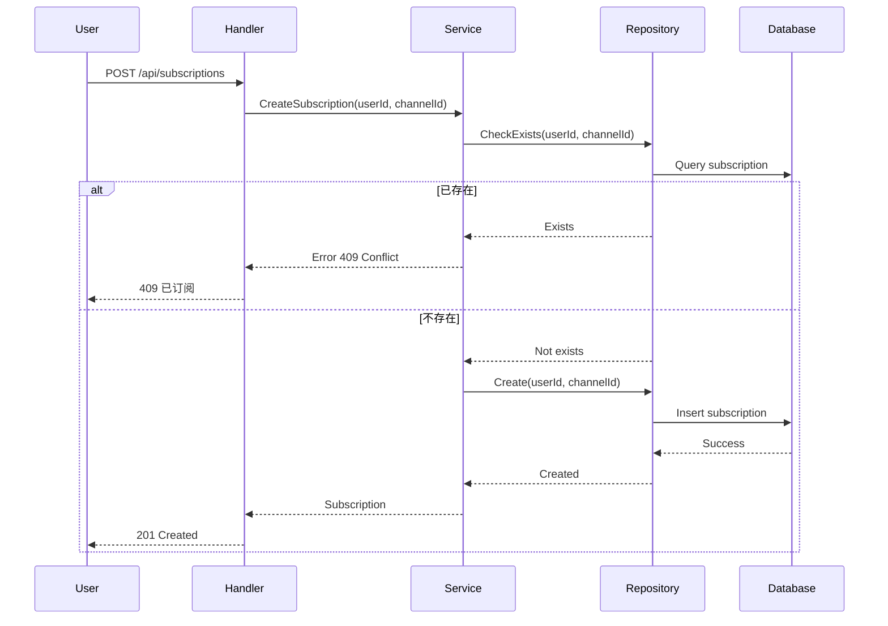

# Fusion 项目 Spec 驱动开发指导手册

## 目录
- [概述](#概述)
- [为什么使用 Spec 工作流程](#为什么使用-spec-工作流程)
- [工作流程](#工作流程)
- [项目集成](#项目集成)
- [开始使用](#开始使用)
- [各阶段详解](#各阶段详解)
- [最佳实践](#最佳实践)
- [常见问题](#常见问题)
- [示例](#示例)

---

## 概述

本指南介绍如何在 **Fusion 项目**中使用 Spec 工作流程进行规范化开发。Spec 工作流程是一种从需求到实现的系统化方法，确保每个功能都经过详细的规划、审批和跟踪。

### 什么是 Spec 工作流程？

Spec 工作流程是一个 **四阶段**的开发方法：
1. **需求阶段 (Requirements)** - 定义要构建什么
2. **设计阶段 (Design)** - 确定如何构建
3. **任务阶段 (Tasks)** - 分解为可执行任务
4. **实现阶段 (Implementation)** - 执行开发

### 项目特点

Fusion 项目是一个基于 Go 的流媒体平台，具有以下特点：
- **Clean Architecture** 架构模式
- **uber-go/fx** 依赖注入
- **EntGO** ORM
- **PostgreSQL** 数据库
- **Fiber v3** Web 框架

---

## 为什么使用 Spec 工作流程

### 优势

✅ **规范化开发流程** - 确保所有功能都经过系统性规划

✅ **减少返工** - 在开发前发现并解决问题

✅ **提高代码质量** - 详细的设计评审

✅ **知识传承** - 完整的文档记录

✅ **团队协作** - 标准化的开发流程

✅ **项目可维护性** - 清晰的架构决策记录

### 适用场景

- 新功能开发
- 重大重构
- API 设计
- 数据库模式变更
- 复杂业务逻辑实现

---

## 工作流程



---

## 项目集成

### 文件结构

```
fusion/
├── .spec-workflow/
│   ├── SPEC-DEVELOPMENT-GUIDE.md      # 本指南
│   ├── templates/                     # 规范模板
│   │   ├── requirements-template.md
│   │   ├── design-template.md
│   │   └── tasks-template.md
│   ├── specs/                         # 规范文档
│   │   └── {feature-name}/
│   │       ├── requirements.md
│   │       ├── design.md
│   │       └── tasks.md
│   └── user-templates/                # 自定义模板
├── internal/                          # 源代码
│   ├── domain/                        # 领域层
│   ├── application/                   # 应用层
│   ├── infrastructure/                # 基础设施层
│   └── interface/                     # 接口层
└── CLAUDE.md                          # 项目说明
```

### 与 Clean Architecture 的关系

Spec 工作流程与 Fusion 的 Clean Architecture 完美契合：

| Spec 阶段 | Clean Architecture 层 |
|-----------|---------------------|
| 需求 (Requirements) | 跨层业务需求分析 |
| 设计 (Design) | 架构决策和层设计 |
| 任务 (Tasks) | 各层具体实现 |
| 实现 (Implementation) | 实际代码编写 |

---

## 开始使用

### 1. 创建新规范

假设我们要添加一个"用户订阅"功能：

```bash
# 规范名称使用 kebab-case
spec-name: user-subscription
```

### 2. 使用命令

```bash
# 查看规范状态
spec-status

# 开始新规范
# 系统会自动引导你完成四个阶段
```

### 3. 审批流程

每个阶段完成后，需要通过审批系统：

- **Dashboard**: http://localhost:5001
- **VS Code 扩展**: 在编辑器中直接审批
- **CLI 命令**: 使用 approvals 工具

⚠️ **重要**: 必须通过审批系统确认，不能仅凭口头同意

---

## 各阶段详解

### 阶段 1: 需求 (Requirements)

**目标**: 明确业务需求和用户价值

**输出文件**: `.spec-workflow/specs/{spec-name}/requirements.md`

#### Fusion 项目需求模板

```markdown
# 用户订阅功能需求文档

## 1. 功能概述
描述功能的目的和价值

## 2. 用户故事
- 作为 [用户类型]
- 我想要 [功能]
- 以便 [价值/目标]

### 故事 1: 订阅频道
- **优先级**: 高
- **验收标准**: EARS 格式

## 3. 业务规则
- 规则 1
- 规则 2

## 4. 非功能性需求
- 性能
- 安全
- 可用性

## 5. 依赖项
- 第三方服务
- 其他功能
```

#### EARS 格式验收标准

```
Given [初始状态]
When [事件/动作]
Then [期望结果]
And [附加结果]
```

**示例**:
```
Given 用户已登录并选择频道
When 用户点击订阅按钮
Then 订阅状态更新为已订阅
And 用户收到确认通知
And 系统记录订阅时间
```

### 阶段 2: 设计 (Design)

**目标**: 创建技术设计方案

**输出文件**: `.spec-workflow/specs/{spec-name}/design.md`

#### Fusion 项目设计模板

```markdown
# 用户订阅功能技术设计

## 1. 架构设计

### 1.1 Clean Architecture 分层
- **Domain Layer**: 实体和接口定义
- **Application Layer**: 应用服务和 DTO
- **Infrastructure Layer**: 数据库实现
- **Interface Layer**: HTTP 处理器

### 1.2 依赖关系图
描述各层如何交互

## 2. 数据模型设计

### 2.1 EntGO Schema
定义数据库模式

### 2.2 实体关系
ER 图或文字描述

## 3. API 设计

### 3.1 RESTful 端点
- POST /api/subscriptions
- GET /api/subscriptions
- DELETE /api/subscriptions/{id}

### 3.2 请求/响应格式
JSON 模式

## 4. 业务流程

### 4.1 订阅流程
时序图或步骤描述

### 4.2 异常处理
错误场景和处理

## 5. 技术选型
- 库和框架
- 设计模式
- 第三方服务

## 6. 权衡与决策
- 替代方案
- 选择理由
- 风险评估
```

#### Fusion 项目设计要点

1. **遵循 Clean Architecture**
   - 依赖倒置
   - 层间隔离
   - 业务逻辑独立

2. **EntGO 最佳实践**
   - 使用软删除 mixin
   - 定义合适的索引
   - 考虑数据迁移

3. **依赖注入 (uber-go/fx)**
   - 模块化设计
   - 生命周期管理
   - 测试友好

4. **错误处理**
   - 自定义错误类型
   - 统一错误处理中间件
   - 结构化日志

### 阶段 3: 任务 (Tasks)

**目标**: 将设计分解为原子任务

**输出文件**: `.spec-workflow/specs/{spec-name}/tasks.md`

#### 任务模板

```markdown
# 用户订阅功能任务列表

## 1. 数据库设计
- [ ] 1.1 创建 EntGO Schema
- [ ] 1.2 生成实体代码
- [ ] 1.3 添加数据库索引

## 2. 领域层实现
- [ ] 2.1 定义订阅实体
- [ ] 2.2 创建仓储接口
- [ ] 2.3 定义业务规则

## 3. 应用层实现
- [ ] 3.1 创建 DTO
- [ ] 3.2 实现应用服务
- [ ] 3.3 编写验证逻辑

## 4. 基础设施层实现
- [ ] 4.1 实现仓储
- [ ] 4.2 配置依赖注入
- [ ] 4.3 添加迁移脚本

## 5. 接口层实现
- [ ] 5.1 创建 HTTP 处理器
- [ ] 5.2 实现中间件
- [ ] 5.3 添加路由
- [ ] 5.4 编写 Swagger 文档

## 6. 测试
- [ ] 6.1 单元测试
- [ ] 6.2 集成测试
- [ ] 6.3 API 测试
```

#### 任务编写最佳实践

1. **原子性**: 每个任务 1-3 个文件
2. **可验证**: 有明确的完成标准
3. **可追踪**: 包含文件路径
4. **按层组织**: 遵循 Clean Architecture

#### 任务描述格式

每个任务应包含：
- 任务名称
- 文件路径
- 实现要求
- 验收标准

### 阶段 4: 实现 (Implementation)

**目标**: 系统化执行开发任务

#### 实现流程

1. **检查状态**
   ```bash
   spec-status
   ```

2. **选择任务**
   - 读取 `tasks.md`
   - 选择 `[ ]` 待办任务

3. **标记进行中**
   ```markdown
   - [ ] 1.1 创建 EntGO Schema
   ```
   修改为：
   ```markdown
   - [-] 1.1 创建 EntGO Schema  # 进行中
   ```

4. **查询现有代码** ⚠️ **关键步骤**
   ```bash
   # 查找现有 API
   get-implementation-logs keyword="api"

   # 查找相关组件
   get-implementation-logs keyword="subscription"

   # 查找 EntGO 相关
   get-implementation-logs artifactType="classes"
   ```

5. **实现代码**
   - 遵循 Clean Architecture
   - 使用 uber-go/fx
   - 参考现有模式

6. **记录实现**
   ```bash
   log-implementation \
     taskId="1.1" \
     summary="创建订阅 EntGO Schema" \
     artifacts="{...}" \
     filesModified="[...]" \
     filesCreated="[...]" \
     statistics="{linesAdded: 150, linesRemoved: 0}"
   ```

7. **标记完成**
   ```markdown
   - [-] 1.1 创建 EntGO Schema
   ```
   修改为：
   ```markdown
   - [x] 1.1 创建 EntGO Schema  # 已完成
   ```

---

## 最佳实践

### 1. 需求阶段

✅ **DO**
- 使用用户故事描述功能
- 写清 EARS 格式验收标准
- 包含业务规则和边界条件
- 明确非功能性需求

❌ **DON'T**
- 跳过用户价值说明
- 遗漏异常场景
- 混合多个功能点
- 过于技术化的描述

### 2. 设计阶段

✅ **DO**
- 遵循 Clean Architecture 分层
- 绘制架构图和时序图
- 明确技术选型理由
- 考虑性能和安全
- 包含错误处理策略

❌ **DON'T**
- 忽略现有架构模式
- 跳过数据库设计
- 不考虑测试
- 过度设计
- 遗漏依赖项

### 3. 任务阶段

✅ **DO**
- 分解为原子任务
- 按层组织任务
- 包含文件路径
- 明确验收标准
- 考虑依赖关系

❌ **DON'T**
- 任务过于庞大
- 跳过测试任务
- 忽略文档更新
- 不考虑集成
- 遗漏部署

### 4. 实现阶段

✅ **DO**
- 使用 `get-implementation-logs` 查询现有代码
- 复用现有组件
- 遵循项目代码规范
- 及时记录实现详情
- 运行测试验证

❌ **DON'T**
- 跳过现有代码查询
- 重造轮子
- 忽略错误处理
- 不写日志
- 跳过测试

### 5. Fusion 项目特定实践

#### 代码组织
```go
// 遵循现有模式
type SubscriptionService struct {
    repo     repository.SubscriptionRepository
    logger   *zap.Logger
    config   *config.Config
}

// 使用 uber-go/fx
func NewSubscriptionService(
    repo repository.SubscriptionRepository,
    logger *zap.Logger,
    config *config.Config,
) *SubscriptionService {
    return &SubscriptionService{
        repo:   repo,
        logger: logger,
        config: config,
    }
}
```

#### 错误处理
```go
// 使用自定义错误
if err != nil {
    return nil, errors.BadRequest("subscription not found", err)
}
```

#### 验证
```go
// 使用 validator
if err := validate.Struct(subscriptionDTO); err != nil {
    return errors.Wrap(err, "validation failed")
}
```

#### 日志
```go
// 结构化日志
logger.Info("subscription created",
    zap.String("user_id", userID),
    zap.String("channel_id", channelID),
    zap.Time("created_at", time.Now()),
)
```

---

## 常见问题

### Q1: 什么时候使用 Spec 工作流程？

**A**: 建议在以下情况使用：
- 新功能开发
- 重大重构
- 复杂业务逻辑
- 外部 API 设计
- 数据库模式变更
- 需要团队协作的功能

对于简单任务（如小 bug 修复），可以跳过。

### Q2: 如何处理多个功能并行开发？

**A**: 一次只处理一个规范，确保：
- 每个功能有完整的工作流程
- 避免规范间冲突
- 按优先级排序
- 使用分支隔离

### Q3: 审批失败怎么办？

**A**: 根据反馈更新文档：
1. 仔细阅读审批意见
2. 更新相应的 `.md` 文件
3. 重新提交审批
4. 等待再次审批
5. 确认删除后继续

### Q4: 实施过程中发现设计问题？

**A**:
1. 停止当前任务
2. 更新 `design.md`
3. 重新审批设计
4. 更新 `tasks.md`（如需要）
5. 继续实施

### Q5: 如何与现有功能集成？

**A**: 使用 `get-implementation-logs` 工具：
```bash
# 查找相关 API
get-implementation-logs keyword="user"

# 查找相关实体
get-implementation-logs artifactType="classes"

# 查找相关仓储
get-implementation-logs keyword="repository"
```

---

## 示例

### 完整示例：用户订阅功能

#### 1. 需求文档 (requirements.md)

```markdown
# 用户订阅功能需求文档

## 1. 功能概述
允许用户订阅频道，接收新内容通知，提升用户参与度。

## 2. 用户故事

### 故事 1: 订阅频道
- **优先级**: 高
- **作为** 登录用户
- **我想要** 订阅感兴趣的频道
- **以便** 接收该频道新视频的推送通知

**验收标准 (EARS)**:
```
Given 我已登录且在频道页面
When 我点击"订阅"按钮
Then 按钮变为"已订阅"状态
And 显示"订阅成功"提示
And 频道订阅数加 1
And 我收到订阅确认通知
```

### 故事 2: 取消订阅
- **优先级**: 中
- **作为** 已订阅用户
- **我想要** 取消订阅频道
- **以便** 停止接收该频道通知

**验收标准 (EARS)**:
```
Given 我已订阅某频道
When 我点击"取消订阅"按钮
Then 按钮变为"订阅"状态
And 显示"已取消订阅"提示
And 频道订阅数减 1
```

## 3. 业务规则
- 用户只能订阅公开频道
- 用户不能重复订阅同一频道
- 订阅状态实时更新
- 订阅数需要记录和显示

## 4. 非功能性需求
- **性能**: 订阅操作 < 200ms
- **并发**: 支持 1000+ 并发订阅操作
- **一致性**: 订阅状态强一致
- **可用性**: 99.9% 正常运行时间

## 5. 依赖项
- 用户认证系统
- 频道管理功能
- 通知服务
- PostgreSQL 数据库
```

#### 2. 设计文档 (design.md)

```markdown
# 用户订阅功能技术设计

## 1. 架构设计

### 1.1 Clean Architecture 分层

```
┌─────────────────────┐
│   Interface Layer   │  HTTP Handlers, Routes
├─────────────────────┤
│  Application Layer  │  Services, DTOs
├─────────────────────┤
│   Domain Layer      │  Entities, Repository Interfaces
├─────────────────────┤
│ Infrastructure Layer│  Database, External Services
└─────────────────────┘
```

### 1.2 模块依赖
- Interface → Application (依赖应用服务)
- Application → Domain (依赖实体和接口)
- Infrastructure → Domain (实现仓储接口)

## 2. 数据模型设计

### 2.1 EntGO Schema

```go
package schema

import (
    "time"
    "entgo.io/ent"
    "entgo.io/ent/schema/edge"
    "entgo.io/ent/schema/field"
    "github.com/fusion/internal/pkg/entgo/mixin"
)

type Subscription struct {
    ent.Schema
}

func (Subscription) Mixin() []ent.Mixin {
    return []ent.Mixin{
        mixin.SoftDelete{},
    }
}

func (Subscription) Fields() []ent.Field {
    return []ent.Field{
        field.Int("user_id"),
        field.Int("channel_id"),
        field.Time("created_at").
            Default(time.Now),
    }
}

func (Subscription) Edges() []ent.Edge {
    return []ent.Edge{
        edge.To("user", User.Type).
            Ref("subscriptions").
            Field("user_id"),
        edge.To("channel", Channel.Type).
            Ref("subscribers").
            Field("channel_id"),
    }
}

func (Subscription) Indexes() []ent.Index {
    return []ent.Index{
        index.Edges("user", "channel").Unique(),
    }
}
```

### 2.2 实体关系
- User ←→ Subscription (一对多)
- Channel ←→ Subscription (一对多)
- Subscription 唯一约束 (user_id, channel_id)

## 3. API 设计

### 3.1 RESTful 端点

| 方法 | 路径 | 描述 | 认证 |
|------|------|------|------|
| POST | /api/subscriptions | 创建订阅 | 必需 |
| GET | /api/subscriptions | 获取用户订阅列表 | 必需 |
| GET | /api/subscriptions/{channelId} | 获取订阅状态 | 必需 |
| DELETE | /api/subscriptions/{channelId} | 取消订阅 | 必需 |

### 3.2 请求/响应格式

**POST /api/subscriptions**

Request:
```json
{
  "channel_id": 123
}
```

Response (201):
```json
{
  "id": 456,
  "user_id": 789,
  "channel_id": 123,
  "created_at": "2025-11-09T12:00:00Z"
}
```

**GET /api/subscriptions**

Response (200):
```json
{
  "data": [
    {
      "id": 456,
      "channel_id": 123,
      "channel_name": "科技频道",
      "created_at": "2025-11-09T12:00:00Z"
    }
  ],
  "total": 1
}
```

## 4. 业务流程

### 4.1 订阅流程



### 4.2 异常处理

| 错误码 | 场景 | 错误信息 |
|--------|------|----------|
| 400 | 无效参数 | "invalid channel_id" |
| 401 | 未认证 | "unauthorized" |
| 403 | 权限不足 | "forbidden" |
| 404 | 频道不存在 | "channel not found" |
| 409 | 重复订阅 | "already subscribed" |

## 5. 技术选型

### 5.1 库和框架
- **EntGO**: ORM 和模式管理
- **Fiber v3**: HTTP 框架
- **uber-go/fx**: 依赖注入
- **go-playground/validator**: 输入验证
- **zap**: 结构化日志

### 5.2 设计模式
- **Repository Pattern**: 数据访问抽象
- **Service Layer Pattern**: 业务逻辑封装
- **Dependency Injection**: 依赖管理
- **Error Wrapping**: 错误传播

### 5.3 第三方服务
- **PostgreSQL**: 主数据库
- **Redis**: 缓存（可选）
- **RabbitMQ**: 异步通知（未来扩展）

## 6. 权衡与决策

### 6.1 为什么不使用 gRPC？
- **选择 REST**: 团队更熟悉，文档友好，易于调试
- **风险**: 性能略低，但可接受

### 6.2 为什么不使用缓存？
- **选择无缓存**: 订阅状态要求强一致，简化设计
- **未来**: 可添加 Redis 缓存提高性能

### 6.3 为什么不使用事件驱动？
- **选择同步**: 当前规模同步处理足够
- **未来**: 订阅量大时可引入消息队列

## 7. 风险评估

| 风险 | 影响 | 概率 | 缓解措施 |
|------|------|------|----------|
| 重复订阅 | 低 | 中 | 唯一索引 |
| 并发冲突 | 中 | 低 | 事务隔离 |
| 性能问题 | 中 | 低 | 数据库优化 |
```

#### 3. 任务列表 (tasks.md)

```markdown
# 用户订阅功能任务列表

## 1. 数据库设计
- [ ] 1.1 创建 EntGO Subscription Schema
  _文件_: `internal/infrastructure/database/schema/subscription.go`
  _要求_: 定义实体、字段、边和索引
  _验收_: Schema 定义完整，包含软删除和唯一约束

- [ ] 1.2 生成 EntGO 代码
  _文件_: `internal/infrastructure/database/ent/`
  _要求_: 运行 `make generate-ent`
  _验收_: 生成完整的实体和查询代码

- [ ] 1.3 添加数据库索引
  _文件_: `internal/infrastructure/database/schema/subscription.go`
  _要求_: 在 channel_id 和 user_id 上添加索引
  _验收_: 索引定义正确，提高查询性能

## 2. 领域层实现
- [ ] 2.1 定义订阅实体
  _文件_: `internal/domain/entity/subscription.go`
  _要求_: 创建 Subscription 实体结构体
  _验收_: 包含 User、Channel 关联，验证方法

- [ ] 2.2 创建仓储接口
  _文件_: `internal/domain/repository/subscription.go`
  _要求_: 定义仓储接口方法
  _验收_: 包含 CRUD 方法和查询方法

- [ ] 2.3 定义领域服务接口
  _文件_: `internal/domain/service/subscription_service.go`
  _要求_: 业务规则和接口定义
  _验收_: 包含订阅、取消订阅、查询功能

## 3. 应用层实现
- [ ] 3.1 创建 DTO
  _文件_: `internal/application/dto/subscription.go`
  _要求_: 创建请求和响应 DTO
  _验收_: 包含验证标签，序列化正确

- [ ] 3.2 实现应用服务
  _文件_: `internal/application/service/subscription_service.go`
  _要求_: 业务逻辑实现，错误处理
  _验收_: 通过所有业务规则测试

- [ ] 3.3 实现 DTO 转换器
  _文件_: `internal/application/dto/convert/subscription.go`
  _要求_: 实体和 DTO 之间的转换
  _验收_: 转换逻辑正确，无数据丢失

## 4. 基础设施层实现
- [ ] 4.1 实现仓储
  _文件_: `internal/infrastructure/repository/subscription.go`
  _要求_: 实现 EntGO 的仓储接口
  _验收_: 所有方法正确实现，错误处理完善

- [ ] 4.2 配置依赖注入
  _文件_: `internal/infrastructure/module.go`
  _要求_: 使用 uber-go/fx 提供依赖
  _验收_: 所有依赖正确注入，生命周期管理

- [ ] 4.3 更新应用模块
  _文件_: `internal/application/module.go`
  _要求_: 连接领域和应用层
  _验收_: 模块间依赖正确，无循环依赖

## 5. 接口层实现
- [ ] 5.1 创建 HTTP 处理器
  _文件_: `internal/interface/http/handler/subscription.go`
  _要求_: 实现订阅相关端点
  _验收_: 所有端点正确实现，状态码正确

- [ ] 5.2 实现中间件
  _文件_: `internal/interface/http/middleware/`
  _要求_: 认证、验证、日志中间件
  _验收_: 中间件正确工作，不影响性能

- [ ] 5.3 添加路由
  _文件_: `internal/interface/http/route/subscription.go`
  _要求_: 注册订阅路由
  _验收_: 路由正确注册，路径匹配正确

- [ ] 5.4 编写 Swagger 文档
  _文件_: `internal/interface/http/handler/subscription.go`
  _要求_: 使用 Swag 注释
  _验收_: Swagger UI 正确显示

## 6. 测试
- [ ] 6.1 单元测试 - 领域层
  _文件_: `internal/domain/service/subscription_service_test.go`
  _要求_: 测试业务规则
  _验收_: 所有测试通过

- [ ] 6.2 集成测试 - 仓储层
  _文件_: `internal/infrastructure/repository/subscription_test.go`
  _要求_: 使用 enttest 测试
  _验收_: 数据库操作正确

- [ ] 6.3 API 测试 - 处理器
  _文件_: `internal/interface/http/handler/subscription_test.go`
  _要求_: 使用 Fiber 测试工具
  _验收_: HTTP 响应正确

- [ ] 6.4 负载测试
  _文件_: `test/load/subscription_test.go`
  _要求_: 1000+ 并发测试
  _验收_: 性能满足需求

## 7. 文档
- [ ] 7.1 更新 API 文档
  _文件_: `docs/api/subscription.md`
  _要求_: 详细说明 API 使用
  _验收_: 文档完整准确

- [ ] 7.2 更新开发指南
  _文件_: `docs/development/subscription-guide.md`
  _要求_: 订阅功能开发说明
  _验收_: 指南清晰易懂

## 8. 部署
- [ ] 8.1 创建迁移脚本
  _文件_: `scripts/migration/create_subscriptions_table.sql`
  _要求_: 数据库迁移脚本
  _验收_: 迁移执行成功

- [ ] 8.2 更新配置
  _文件_: `configs/config.yaml`
  _要求_: 添加订阅相关配置
  _验收_: 配置正确加载
```

---

## 总结

使用 Spec 工作流程可以确保 Fusion 项目的：
- **开发质量** - 系统化规划和评审
- **架构一致性** - 遵循 Clean Architecture
- **团队协作** - 标准化开发流程
- **项目维护** - 完整文档记录

遵循本指南，你将能够：
1. 创建高质量的需求文档
2. 设计健壮的架构方案
3. 分解可执行的任务
4. 实现可靠的代码

记住：**审批是必须的，口头同意无效！**

---

## 相关资源

- [项目 README](../CLAUDE.md)
- [Docker 指南](../DOCKER.md)
- [Makefile](../Makefile)
- [Spec Dashboard](http://localhost:5001)

---

**最后更新**: 2025-11-09
**版本**: v1.0
**作者**: Fusion 开发团队