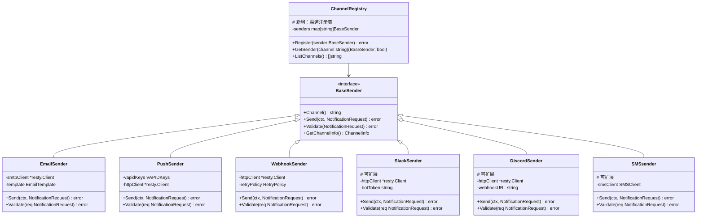

# User Notification System - 技术设计文档

## 概述

本文档描述用户通知系统的技术设计，包括多渠道通知（邮件、网页推送、Webhook）、开播提醒状态管理、用户偏好配置和通知历史记录功能。系统采用可扩展的架构设计，支持轻松添加新的通知方式。系统遵循 Fusion 的 Clean Architecture 原则，采用模块化设计，支持水平扩展和高可用性。

## Steering 文档对齐

### 技术标准对齐（tech.md）

#### 架构模式
- **Clean Architecture**: 分层设计，依赖倒置
  - Domain Layer: 定义通知业务实体和接口
  - Application Layer: 实现通知用例和应用服务
  - Infrastructure Layer: 实现通知渠道和数据存储
  - Interface Layer: 提供 RESTful API

#### 技术选型
- **Go 1.25.3**: 主要开发语言
- **EntGO v0.14.5**: 数据建模和 ORM
- **uber-go/fx v1.24.0**: 依赖注入和生命周期管理
- **Resty v3**: HTTP 客户端用于 Webhook 和邮件发送
- **PostgreSQL**: 主数据存储
- **Redis**: 缓存和队列存储
- **Zap**: 结构化日志记录

#### 外部集成
- **SMTP 服务**: 邮件发送（SendGrid/Amazon SES）
- **Web Push API**: 浏览器推送通知
- **HTTP Webhook**: 第三方系统集成
- **可扩展设计**: 支持未来添加更多通知方式（如 Slack、Discord、短信、钉钉、企业微信等）

### 项目结构对齐（structure.md）

#### 目录组织
```
internal/
├── domain/
│   ├── entity/           # 通知相关实体
│   │   ├── notification.go
│   │   ├── notification_user_preference.go  # 通知用户偏好
│   │   ├── notification_history.go
│   │   └── notification_channel.go
│   ├── repository/       # 仓储接口
│   │   ├── notification.go
│   │   ├── notification_user_preference.go  # 通知偏好仓储
│   │   └── notification_history.go
│   └── service/          # 领域服务
│       ├── notification_service.go
│       ├── notification_preference_service.go
│       ├── notification_history_service.go
│       └── notification_channel_service.go
├── application/
│   ├── dto/              # DTO 定义
│   │   ├── request/      # 请求 DTO
│   │   │   ├── notification.go
│   │   │   ├── preference.go
│   │   │   └── subscription.go
│   │   └── response/     # 响应 DTO
│   │       ├── notification.go
│   │       └── preference.go
│   ├── service/          # 应用服务
│   │   ├── notification_service.go
│   │   ├── preference_service.go
│   │   └── channel_service.go  # 渠道管理应用服务
│   └── module.go
├── infrastructure/
│   ├── database/
│   │   ├── schema/       # EntGO 模式
│   │   │   ├── notification.go
│   │   │   ├── notification_user_preference.go  # 通知偏好模式
│   │   │   ├── notification_history.go
│   │   │   └── notification_channel.go
│   │   └── ent/
│   ├── repository/       # 仓储实现
│   │   ├── notification_repository.go
│   │   ├── notification_user_preference_repository.go  # 通知偏好实现
│   │   └── notification_history_repository.go
│   ├── sender/           # 通知渠道发送器（基础设施层）
│   │   ├── base_sender.go      # 基础发送器接口
│   │   ├── email_sender.go     # 邮件发送器（包含 SMTP 配置）
│   │   ├── push_sender.go      # 推送发送器（包含 VAPID 配置）
│   │   ├── webhook_sender.go   # Webhook 发送器（包含签名配置）
│   │   ├── slack_sender.go     # Slack 发送器（包含 Bot Token 配置）
│   │   ├── discord_sender.go   # Discord 发送器（包含 Webhook 配置）
│   │   ├── sms_sender.go       # 短信发送器（包含 API 配置）
│   │   ├── dingtalk_sender.go  # 钉钉发送器（包含 Secret 配置）
│   │   ├── wechat_sender.go    # 企业微信发送器（包含 AgentID 配置）
│   │   └── registry.go         # 渠道注册表
│   ├── queue/            # 消息队列
│   │   ├── redis_queue.go
│   │   └── notification_queue.go
│   └── module.go
└── interface/
    └── http/
        ├── handler/      # HTTP 处理器
        │   ├── notification.go
        │   ├── preference.go
        │   └── channel.go         # 渠道管理处理器
        ├── middleware/
        │   ├── auth.go            # 认证中间件
        │   ├── cors.go            # CORS 中间件
        │   ├── logger.go          # 日志中间件
        │   └── rate_limit.go      # 频率限制中间件（防止通知滥用）
        └── route/        # 路由
            ├── notification.go
            ├── preference.go
            └── channel.go         # 渠道路由
```

#### 命名规范
- 文件: `snake_case.go`
- 结构体: `PascalCase`
- 函数/方法: `camelCase`
- 常量: `UPPER_SNAKE_CASE`
- 遵循 Go 标准库和项目约定

## 代码复用分析

### 现有组件复用

#### 1. 认证和用户系统
- **复用位置**: `internal/domain/entity/user.go`
- **复用方式**:
  - 通知系统依赖现有用户实体
  - 使用用户 ID 关联通知
  - 利用用户邮箱字段发送邮件
- **扩展点**:
  - 可在用户实体中添加通知相关字段（如果需要）

#### 2. 日志系统
- **复用位置**: `internal/infrastructure/logger/module.go`
- **复用方式**:
  - 通知发送日志使用 Zap
  - 结构化日志记录
  - 区分不同渠道的日志
- **记录内容**:
  - 通知发送尝试
  - 发送结果（成功/失败）
  - 失败原因和重试次数

#### 3. 配置系统
- **复用位置**: `internal/infrastructure/config/module.go`
- **复用方式**:
  - 每个渠道的独立配置
  - 通用配置模板
  - 动态配置加载
  - 通知配置集成到现有 config.go 结构中

**通知配置集成说明:**
在 `internal/infrastructure/config/config.go` 中添加通知相关配置结构：

```go
type Config struct {
    // ... existing config fields ...

    // Notification Configuration
    Notification NotificationConfig `mapstructure:"notification"`
}

type NotificationConfig struct {
    Email EmailConfig    `mapstructure:"email"`
    Push  PushConfig     `mapstructure:"push"`
    Webhook WebhookConfig `mapstructure:"webhook"`
    // 可扩展更多渠道
}

type EmailConfig struct {
    SMTPHost     string `mapstructure:"smtp_host"`
    SMTPPort     int    `mapstructure:"smtp_port"`
    Username     string `mapstructure:"username"`
    Password     string `mapstructure:"password"`
    FromAddress  string `mapstructure:"from_address"`
    FromName     string `mapstructure:"from_name"`
}

type PushConfig struct {
    VAPIDPublicKey  string `mapstructure:"vapid_public_key"`
    VAPIDPrivateKey string `mapstructure:"vapid_private_key"`
    VAPIDSubject    string `mapstructure:"vapid_subject"`
}

type WebhookConfig struct {
    SignatureSecret string `mapstructure:"signature_secret"`
    TimeoutSeconds  int    `mapstructure:"timeout_seconds"`
    MaxRetries      int    `mapstructure:"max_retries"`
}

// 可扩展更多渠道配置
```

每个 sender 在初始化时通过 uber-go/fx 从配置中获取对应的配置参数，实现配置与发送器的解耦。

#### 4. 错误处理
- **复用位置**: `internal/pkg/errors/`
- **复用方式**:
  - 使用统一错误类型
  - 渠道特定错误
  - 错误传播和包装

### 集成点

#### 1. 订阅系统集成
- **集成方式**: 事件驱动
- **触发点**: 主播状态变更
- **数据流**:
  ```
  平台 API → 平台集成服务 → 事件发布 → 通知服务 → 通知发送
  ```
- **接口**: 通过事件总线或直接调用

#### 2. 用户系统集成
- **集成方式**: 直接依赖
- **数据流**: 通知服务查询用户信息
- **接口**: 用户仓储接口

#### 3. 数据库存储
- **集成方式**: 共享数据库
- **连接池**: 复用现有数据库连接
- **事务**: 通知操作使用事务保证一致性

## 架构设计

### 整体架构

```mermaid
graph TD
    A[平台 API] --> B[平台集成服务]
    B --> C[主播开播事件]
    C --> D[通知触发器]
    D --> E[通知路由器]
    E --> F{检查提醒状态}
    F -->|开启| G[渠道管理器]
    F -->|关闭| H[记录忽略]
    G --> I[配置管理器]
    I --> J{检查用户偏好}
    J -->|启用| K[队列管理器]
    J -->|禁用| L[跳过渠道]
    K --> M[消息队列]
    M --> N[通知发送器]
    N --> O[邮件发送]
    N --> P[推送发送]
    N --> Q[Webhook 发送]
    N --> R[Slack 发送]     # 可扩展
    N --> S[Discord 发送]   # 可扩展
    N --> T[短信发送]       # 可扩展
    O --> U[通知历史]
    P --> U
    Q --> U
    R --> U
    S --> U
    T --> U
    U --> V[PostgreSQL]
    M --> W[Redis 队列]
    D --> X[用户偏好检查]
    X --> Y[时间窗口检查]
    Y --> Z[频率限制检查]
```

### 分层架构

```mermaid
graph LR
    subgraph Interface Layer
        A[HTTP Handlers]
        B[REST API]
        C[WebSocket]
        D[Channel Management API]
    end
    subgraph Application Layer
        E[Notification App Service]
        F[Preference App Service]
        G[History App Service]
        H[Channel App Service]  # 新增：渠道管理
    end
    subgraph Domain Layer
        I[Notification Entity]
        J[UserPreference Entity]
        K[NotificationHistory Entity]
        L[NotificationChannel Entity]  # 新增：渠道实体
        M[Channel Service Interface]   # 新增：渠道服务接口
    end
    subgraph Infrastructure Layer
        N[Repository Impl]
        O[Email Sender]
        P[Push Sender]
        Q[Webhook Sender]
        R[Slack Sender]    # 可扩展
        S[Discord Sender]  # 可扩展
        T[SMS Sender]      # 可扩展
        U[Channel Registry] # 新增：渠道注册表
        V[Queue Service]
    end
    A --> E
    B --> E
    D --> H
    H --> M
    M --> I
    M --> J
    N --> I
    O --> K
    P --> K
    Q --> K
    R --> K
    S --> K
    T --> K
    U --> N
```

### 可扩展通知方式架构

#### 核心设计原则



#### 通知渠道接口

```go
// 基础通知发送器接口
type BaseSender interface {
    // 渠道名称
    Channel() string

    // 发送通知
    Send(ctx context.Context, req NotificationRequest) error

    // 验证请求
    Validate(req NotificationRequest) error

    // 获取渠道信息
    GetChannelInfo() ChannelInfo
}

// 通知请求结构
type NotificationRequest struct {
    UserID      int64              `json:"user_id"`
    StreamerID  int64              `json:"streamer_id"`
    StreamerName string           `json:"streamer_name"`
    Platform    string             `json:"platform"`
    Title       string             `json:"title"`
    URL         string             `json:"url"`
    Thumbnail   string             `json:"thumbnail,omitempty"`
    Metadata    map[string]interface{} `json:"metadata,omitempty"`
}

// 渠道信息
type ChannelInfo struct {
    Name        string            `json:"name"`
    DisplayName string            `json:"display_name"`
    Description string            `json:"description"`
    Config      map[string]string `json:"config"`  // 渠道特定配置
    Enabled     bool              `json:"enabled"`
}

// 渠道注册表
type ChannelRegistry struct {
    senders map[string]BaseSender
    logger  *zap.Logger
}

// 注册新渠道
func (r *ChannelRegistry) Register(sender BaseSender) error {
    r.senders[sender.Channel()] = sender
    return nil
}

// 获取渠道发送器
func (r *ChannelRegistry) GetSender(channel string) (BaseSender, bool) {
    sender, ok := r.senders[channel]
    return sender, ok
}

// 列出所有渠道
func (r *ChannelRegistry) ListChannels() []string {
    channels := make([]string, 0, len(r.senders))
    for channel := range r.senders {
        channels = append(channels, channel)
    }
    return channels
}
```

#### 新增通知方式示例

##### 1. Slack 集成
```go
type SlackSender struct {
    httpClient *resty.Client
    botToken   string
    defaultChannel string
    logger     *zap.Logger
}

func (s *SlackSender) Channel() string {
    return "slack"
}

func (s *SlackSender) Send(ctx context.Context, req NotificationRequest) error {
    // 构建 Slack 消息
    message := SlackMessage{
        Channel: s.defaultChannel,
        Text:    fmt.Sprintf("%s 开播啦！", req.StreamerName),
        Blocks: []SlackBlock{
            {
                Type: "section",
                Text: &SlackText{
                    Type: "mrkdwn",
                    Text: fmt.Sprintf("*%s* 正在 %s 平台直播\n🎮 %s\n👀 [立即观看](%s)",
                        req.StreamerName, req.Platform, req.Title, req.URL),
                },
            },
        },
    }

    // 发送消息
    resp, err := s.httpClient.R().
        SetContext(ctx).
        SetHeader("Authorization", "Bearer "+s.botToken).
        SetBody(message).
        Post("https://slack.com/api/chat.postMessage")

    if err != nil {
        return err
    }

    if !resp.IsSuccess() {
        return errors.New("slack request failed")
    }

    s.logger.Info("Slack notification sent",
        zap.Int64("user_id", req.UserID),
        zap.String("streamer", req.StreamerName),
    )

    return nil
}
```

##### 2. Discord 集成
```go
type DiscordSender struct {
    httpClient *resty.Client
    webhookURL string
    logger     *zap.Logger
}

func (d *DiscordSender) Send(ctx context.Context, req NotificationRequest) error {
    embed := DiscordEmbed{
        Title:       fmt.Sprintf("%s 开播啦！", req.StreamerName),
        Description: req.Title,
        Color:       0x7289DA, // Discord 蓝色
        Fields: []DiscordField{
            {
                Name:   "平台",
                Value:  req.Platform,
                Inline: true,
            },
            {
                Name:   "链接",
                Value:  fmt.Sprintf("[立即观看](%s)", req.URL),
                Inline: false,
            },
        },
        Thumbnail: &DiscordThumbnail{
            URL: req.Thumbnail,
        },
    }

    message := DiscordMessage{
        Content: "",
        Embeds:  []DiscordEmbed{embed},
    }

    resp, err := d.httpClient.R().
        SetContext(ctx).
        SetBody(message).
        Post(d.webhookURL)

    if err != nil {
        return err
    }

    if !resp.IsSuccess() {
        return errors.New("discord request failed")
    }

    return nil
}
```

##### 3. 短信通知
```go
type SMSsender struct {
    smsClient SMSClient
    logger    *zap.Logger
}

func (s *SMSsender) Send(ctx context.Context, req NotificationRequest) error {
    // 注意：短信需要用户配置手机号
    phoneNumber, err := s.getUserPhoneNumber(req.UserID)
    if err != nil {
        return err
    }

    message := fmt.Sprintf("[Fusion] %s 正在 %s 平台直播，标题：%s，立即观看：%s",
        req.StreamerName, req.Platform, req.Title, req.URL)

    if len(message) > 160 {
        message = message[:157] + "..."
    }

    err = s.smsClient.Send(ctx, phoneNumber, message)
    if err != nil {
        return err
    }

    s.logger.Info("SMS notification sent",
        zap.Int64("user_id", req.UserID),
        zap.String("phone", phoneNumber),
    )

    return nil
}
```

#### 模块化设计原则

#### 1. 单一职责
- **通知发送器**: 每个发送器只负责一种渠道
- **通知路由器**: 只负责路由，不关心发送
- **用户偏好服务**: 只管理偏好，不关心通知
- **渠道管理器**: 只管理渠道配置和注册

#### 2. 组件隔离
- 每个通知渠道独立实现
- 渠道间无直接依赖
- 通过接口解耦
- 可热插拔添加新渠道

#### 3. 服务层分离
- **数据访问层**: 仓储模式，抽象数据存储
- **业务逻辑层**: 通知规则、偏好检查
- **接口层**: HTTP 处理器、API 端点
- **渠道层**: 独立的通知渠道实现

#### 4. 实用工具模块化
- 邮件模板工具
- 推送载荷构建器
- Webhook 数据序列化器
- 重试策略工具
- 渠道配置管理器

## 组件和接口

### 1. 通知核心组件

#### NotificationService (Domain)
```go
type NotificationService struct {
    // 依赖
    repo        repository.NotificationRepository
    prefRepo    repository.UserPreferenceRepository
    historyRepo repository.NotificationHistoryRepository
    channelSvc  ChannelService
    eventBus    EventBus
    logger      *zap.Logger
}

// 主要方法
func (s *NotificationService) ProcessStreamStartEvent(event StreamStartEvent) error
func (s *NotificationService) GetNotificationHistory(userID int64, req GetHistoryRequest) ([]NotificationHistory, error)
func (s *NotificationService) MarkAsRead(userID, historyID int64) error
```

#### 职责
- 处理主播开播事件
- 检查用户提醒状态和偏好
- 触发通知发送
- 管理通知历史

### 2. 提醒状态管理组件

#### SubscriptionNotificationService (Application)
```go
type SubscriptionNotificationService struct {
    notifSvc *NotificationService
    prefSvc  *UserPreferenceService
    repo     repository.SubscriptionRepository
}

// 主要方法
func (s *SubscriptionNotificationService) UpdateStreamNotifyStatus(userID, subscriptionID int64, enabled bool) error
func (s *SubscriptionNotificationService) BatchUpdateNotifyStatus(userID int64, req BatchUpdateRequest) error
func (s *SubscriptionNotificationService) GetSubscriptionNotifyStatus(userID int64) ([]SubscriptionNotifyStatus, error)
```

#### 职责
- 管理订阅主播的开播提醒状态
- 提供批量操作接口
- 查询提醒状态

### 3. 通知渠道管理

#### ChannelService (Application)
```go
type ChannelService struct {
    registry *ChannelRegistry
    logger   *zap.Logger
}

// 主要方法
func (s *ChannelService) RegisterChannel(sender BaseSender) error
func (s *ChannelService) GetChannel(channel string) (BaseSender, bool)
func (s *ChannelService) ListChannels() []ChannelInfo
func (s *ChannelService) UpdateChannelConfig(channel string, config map[string]string) error
func (s *ChannelService) EnableChannel(channel string) error
func (s *ChannelService) DisableChannel(channel string) error
```

#### ChannelRegistry (Infrastructure)
```go
type ChannelRegistry struct {
    senders map[string]BaseSender
    config  map[string]*ChannelConfig
    mutex   sync.RWMutex
    logger  *zap.Logger
}

// 主要方法
func (r *ChannelRegistry) Register(sender BaseSender) error
func (r *ChannelRegistry) GetSender(channel string) (BaseSender, bool)
func (r *ChannelRegistry) ListChannels() []string
func (r *ChannelRegistry) GetConfig(channel string) (*ChannelConfig, bool)
func (r *ChannelRegistry) UpdateConfig(channel string, config *ChannelConfig) error
```

### 4. 可扩展通知渠道

#### 基础渠道实现
```go
// 邮件发送器
type EmailSender struct {
    smtpClient *resty.Client
    template   *EmailTemplate
    logger     *zap.Logger
}

// 推送发送器
type PushSender struct {
    vapidPublicKey  string
    vapidPrivateKey string
    httpClient      *resty.Client
    logger          *zap.Logger
}

// Webhook 发送器
type WebhookSender struct {
    httpClient   *resty.Client
    retryPolicy  RetryPolicy
    signature    SignatureVerifier
    logger       *zap.Logger
}

// Slack 发送器
type SlackSender struct {
    httpClient   *resty.Client
    botToken     string
    defaultChannel string
    logger       *zap.Logger
}

// Discord 发送器
type DiscordSender struct {
    httpClient *resty.Client
    webhookURL string
    logger     *zap.Logger
}

// 短信发送器
type SMSsender struct {
    smsClient  SMSClient
    smsConfig  SMSConfig
    logger     *zap.Logger
}
```

### 5. 消息队列

#### NotificationQueue (Infrastructure)
```go
type NotificationQueue struct {
    redisClient redis.Client
    logger      *zap.Logger
}

func (q *NotificationQueue) Enqueue(notification Notification) error
func (q *NotificationQueue) Dequeue() (Notification, error)
```

### 6. 用户偏好管理

#### UserPreferenceService (Application)
```go
type UserPreferenceService struct {
    repo   repository.UserPreferenceRepository
    logger *zap.Logger
}

// 主要方法
func (s *UserPreferenceService) GetPreferences(userID int64) (*UserPreferences, error)
func (s *UserPreferenceService) UpdatePreferences(userID int64, req UpdatePreferencesRequest) error
func (s *UserPreferenceService) CheckTimeWindow(userID int64, now time.Time) (bool, error)
func (s *UserPreferenceService) IsChannelEnabled(userID int64, channel string) (bool, error)
```

## 数据模型

### 1. NotificationUserPreference 实体（简化为真正偏好设置）
```go
type NotificationUserPreference struct {
    ID                    int64      `json:"id"`
    UserID                int64      `json:"user_id"`
    // 免打扰时间设置
    QuietHoursEnabled     bool       `json:"quiet_hours_enabled"`
    QuietHoursStart       string     `json:"quiet_hours_start"`  // HH:MM format
    QuietHoursEnd         string     `json:"quiet_hours_end"`    // HH:MM format
    // 平台过滤（白名单）
    PlatformFilters       []string   `json:"platform_filters"`
    // 频率限制
    MaxNotificationsPerMin int       `json:"max_notifications_per_min"`
    CreatedAt             time.Time  `json:"created_at"`
    UpdatedAt             time.Time  `json:"updated_at"`
}
```

**重要说明：**
- **渠道启用/禁用** → 通过 `NotificationChannel` 表的 `Enabled` 字段控制
- **主播提醒开关** → 通过 `Subscription` 表的 `NotifyEnabled` 字段控制
- **NotificationUserPreference** 只保留真正的"偏好"设置，去除冗余的渠道控制字段

### 2. NotificationHistory 实体（精简版）
```go
type NotificationHistory struct {
    ID            int64             `json:"id"`
    UserID        int64             `json:"user_id"`
    Channel       string            `json:"channel"`
    Status        NotificationStatus `json:"status"`
    SentAt        time.Time         `json:"sent_at"`
    DeliveredAt   time.Time         `json:"delivered_at,omitempty"`
    ReadAt        time.Time         `json:"read_at,omitempty"`
    ErrorMessage  string            `json:"error_message,omitempty"`
    RetryCount    int               `json:"retry_count"`
    // 主播相关信息存储在 metadata 中
    Metadata      map[string]interface{} `json:"metadata,omitempty"`
    CreatedAt     time.Time         `json:"created_at"`
}
```

**重要说明：**
- 主播相关信息（StreamerID, StreamerName, Platform, StreamTitle, StreamURL, ThumbnailURL）全部存储在 `Metadata` 字段中
- 这样可以灵活存储任意主播和直播信息，无需修改表结构

### 3. NotificationChannel 实体（用户级配置-极简版）
```go
type NotificationChannel struct {
    ID          int64    `json:"id"`
    UserID      int64    `json:"user_id"`       // 外键关联到 user 表
    Channel     string   `json:"channel"`       // 渠道名称: email, push, webhook, slack, discord, sms
    // 所有用户级配置存储在 Config 字段中（如 WebhookURL、SlackChannel、PhoneNumber 等）
    Config      JSON     `json:"config"`
    Enabled     bool     `json:"enabled"`       // 用户是否启用此渠道
    Priority    int      `json:"priority"`      // 用户设置的优先级（1-10）
    CreatedAt   time.Time `json:"created_at"`
    UpdatedAt   time.Time `json:"updated_at"`
}
```

**重要说明：**
- 用户级配置（WebhookURL、SlackChannel、PhoneNumber 等）全部存储在 `Config` 字段的 JSON 中
- 不同渠道的配置完全解耦，可灵活扩展
- 示例 Config 内容：
  ```json
  {
    "webhook_url": "https://example.com/webhook",
    "slack_channel": "#general",
    "phone_number": "+1234567890"
  }
  ```

### 4. Subscription 实体（扩展）
```go
type Subscription struct {
    ID          int64  `json:"id"`
    UserID      int64  `json:"user_id"`
    StreamerID  int64  `json:"streamer_id"`
    StreamerName string `json:"streamer_name"`
    Platform    string `json:"platform"`
    NotifyEnabled bool  `json:"notify_enabled"`  // 开播提醒开关
    CreatedAt   time.Time `json:"created_at"`
    UpdatedAt   time.Time `json:"updated_at"`
}
```

**Notification Schema 文件说明 (notification.go):**
`notification.go` 是 EntGO 模式定义文件，包含以下数据结构及其字段：

**1. NotificationUserPreference (用户通知偏好表)**
- **说明**: 存储用户个人真正偏好设置和行为限制（简化版）
- **字段**:
  - `ID`: int64，主键
  - `UserID`: int64，用户ID，外键关联到 user 表
  - `QuietHoursEnabled`: bool，是否启用免打扰时间
  - `QuietHoursStart`: string，免打扰开始时间（HH:MM格式）
  - `QuietHoursEnd`: string，免打扰结束时间（HH:MM格式）
  - `PlatformFilters`: []string，用户关注的平台白名单
  - `MaxNotificationsPerMin`: int，用户每分钟最大通知数
  - `CreatedAt`: time.Time，创建时间
  - `UpdatedAt`: time.Time，更新时间
- **注意**: 渠道启用/禁用已移至NotificationChannel表（通过Enabled字段），避免数据冗余

**2. NotificationHistory (通知历史记录表-精简版)**
- **说明**: 记录每次通知发送的详细信息，主播相关数据存储在metadata中
- **字段**:
  - `ID`: int64，主键
  - `UserID`: int64，用户ID，外键关联到 user 表
  - `Channel`: string，通知渠道（email/push/webhook等）
  - `Status`: string，状态（sent/delivered/read/failed）
  - `SentAt`: time.Time，发送时间
  - `DeliveredAt`: time.Time，送达时间
  - `ReadAt`: time.Time，阅读时间
  - `ErrorMessage`: string，错误信息
  - `RetryCount`: int，重试次数
  - `Metadata`: map[string]interface{}，主播相关信息存储在此（如 streamer_id, streamer_name, platform, stream_title, stream_url, thumbnail_url）
  - `CreatedAt`: time.Time，创建时间
- **注意**: 主播相关字段已移除，统一存储在 metadata 中

**3. NotificationChannel (用户级通知渠道配置表-极简版)**
- **说明**: 存储用户个人的渠道配置信息（系统级配置在config.go中）
- **字段**:
  - `ID`: int64，主键
  - `UserID`: int64，用户ID，外键关联到 user 表
  - `Channel`: string，渠道名称（email/push/webhook/slack/discord/sms等）
  - `Config`: JSON，所有用户级配置存储在此（如 webhook_url, slack_channel, phone_number 等）
  - `Enabled`: bool，用户是否启用此渠道
  - `Priority`: int，用户设置的优先级（1-10，10最高）
  - `CreatedAt`: time.Time，创建时间
  - `UpdatedAt`: time.Time，更新时间
- **注意**: 具体配置字段已全部移至 Config JSON 中，实现完全解耦

**4. Subscription (订阅表扩展)**
- **说明**: 存储用户订阅关系及开播提醒开关状态
- **字段**:
  - `ID`: int64，主键
  - `UserID`: int64，用户ID，外键关联到 user 表
  - `StreamerID`: int64，主播ID
  - `StreamerName`: string，主播名称
  - `Platform`: string，直播平台
  - `NotifyEnabled`: bool，该订阅的开播提醒开关
  - `CreatedAt`: time.Time，创建时间
  - `UpdatedAt`: time.Time，更新时间

**配置层次说明**:
- **系统级配置** (config.go):
  - 邮件SMTP设置
  - 推送VAPID密钥
  - Webhook签名密钥
  - 系统全局限制和重试策略

- **用户级配置** (NotificationChannel 表):
  - 用户个人的Webhook URL
  - 用户自己的Slack配置
  - 用户个人的Discord Webhook
  - 用户手机号等个人信息
  - **渠道启用/禁用** (通过Enabled字段)

- **用户偏好** (NotificationUserPreference 表):
  - 免打扰时间设置
  - 平台过滤器
  - 频率限制设置
  - **注意**: 不再包含渠道启用字段（已移至NotificationChannel表）

- **订阅级开关** (Subscription 表):
  - 主播开播提醒开关（通过NotifyEnabled字段）

每个结构体都使用 EntGO 的注解（`@id`, `@uid`, `@index`, `@foreignKey`等）定义数据库字段、约束和关联关系，支持自动迁移和代码生成。

## 错误处理

### 错误场景

#### 1. 邮件发送失败
- **场景**: SMTP 服务不可用或邮件被拒收
- **处理**:
  - 记录错误日志
  - 尝试重试（3次，指数退避）
  - 标记通知状态为失败
  - 发送告警（如果配置）
- **用户影响**: 用户不会收到邮件，但可能通过其他渠道收到通知

#### 2. 推送通知被拒绝
- **场景**: 用户未授权或浏览器不支持
- **处理**:
  - 记录推送失败
  - 可选：提示用户授权推送
  - 其他渠道继续发送
- **用户影响**: 用户不会收到推送通知，但可手动开启

#### 3. Webhook 调用失败
- **场景**: Webhook URL 不可达或返回错误
- **处理**:
  - 重试机制（3次）
  - 记录失败原因
  - 暂停该用户的 Webhook 通知
  - 通知用户配置问题
- **用户影响**: 该渠道暂时不可用

#### 4. 渠道发送失败（新渠道）
- **场景**: Slack/Discord/短信等渠道发送失败
- **处理**:
  - 渠道特定重试策略
  - 记录详细错误信息
  - 标记该渠道为临时不可用
  - 尝试其他启用的渠道
- **用户影响**: 该渠道通知失败，其他渠道继续

#### 5. 频率限制触发
- **场景**: 用户收到通知过多
- **处理**:
  - 暂停发送当前通知
  - 记录频率限制
  - 等待冷却期后继续
  - 可选：合并通知
- **用户影响**: 部分通知可能延迟或合并

#### 6. 新渠道配置错误
- **场景**: 用户配置了不正确的渠道信息
- **处理**:
  - 验证配置信息
  - 提供详细错误信息
  - 建议用户检查配置
  - 暂停该渠道发送
- **用户影响**: 需要重新配置才能使用该渠道

### 错误响应格式
```json
{
  "error": {
    "code": "NOTIFICATION_SEND_FAILED",
    "message": "Failed to send notification",
    "details": {
      "channel": "slack",
      "reason": "invalid_token",
      "suggestion": "Please check your Slack bot token"
    }
  }
}
```

## 测试策略

### 单元测试

#### 1. 领域层测试
- **NotificationService**:
  - 测试事件处理逻辑
  - 测试提醒状态检查
  - 测试频率限制
  - 测试渠道路由

- **UserPreferenceService**:
  - 测试时间窗口检查
  - 测试平台过滤
  - 测试偏好验证
  - 测试渠道启用检查

#### 2. 应用层测试
- **SubscriptionNotificationService**:
  - 测试提醒状态更新
  - 测试批量操作
  - 测试查询功能

- **ChannelService**:  # 新增测试
  - 测试渠道注册
  - 测试配置更新
  - 测试渠道列表

#### 3. 基础设施层测试
- **EmailSender**:
  - 测试 SMTP 连接
  - 测试邮件模板渲染
  - 测试发送逻辑

- **PushSender**:
  - 测试 VAPID 密钥
  - 测试推送载荷
  - 测试订阅管理

- **WebhookSender**:
  - 测试 HTTP 调用
  - 测试重试机制
  - 测试签名验证

- **SlackSender**:  # 新增测试
  - 测试 Slack API 调用
  - 测试消息格式
  - 测试错误处理

- **DiscordSender**:  # 新增测试
  - 测试 Discord Webhook
  - 测试 Embed 格式
  - 测试图片上传

- **SMSsender**:  # 新增测试
  - 测试短信 API
  - 测试字符长度限制
  - 测试成本控制

### 集成测试

#### 1. 通知流程测试
- **完整流程**:
  ```
  主播开播 → 触发事件 → 检查提醒状态 → 路由渠道 → 发送通知 → 记录历史
  ```
- **测试场景**:
  - 提醒开启时通知发送
  - 提醒关闭时不发送
  - 多个渠道同时发送
  - 频率限制生效
  - 新渠道集成测试

#### 2. 渠道扩展测试
- **添加新渠道**:
  - 验证渠道注册流程
  - 测试配置管理
  - 测试发送流程
  - 测试错误处理

#### 3. 数据库测试
- 使用 **enttest** 包
- 测试仓储层 CRUD
- 测试事务一致性
- 测试索引和查询
- 测试新字段支持

#### 4. 队列测试
- 使用 **testcontainers** 或 **mock**
- 测试入队/出队
- 测试重试机制
- 测试并发安全

### 端到端测试

#### 1. API 端点测试
- **GET /api/notifications/history**: 获取通知历史
- **GET /api/notifications/preferences**: 获取偏好
- **PUT /api/notifications/preferences**: 更新偏好
- **PUT /api/subscriptions/{id}/notify**: 切换提醒状态
- **POST /api/subscriptions/notify/batch**: 批量操作
- **GET /api/channels**: 获取可用渠道（新增）
- **GET /api/channels/{name}**: 获取渠道信息（新增）
- **PUT /api/channels/{name}/config**: 更新渠道配置（新增）

#### 2. 用户场景测试
- **场景 1**: 订阅主播并开启提醒 → 收到通知
- **场景 2**: 关闭提醒 → 不再收到通知
- **场景 3**: 设置免打扰时间 → 延迟通知
- **场景 4**: 配置 Webhook → 接收推送
- **场景 5**: 配置 Slack → 发送到 Slack（新增）
- **场景 6**: 配置 Discord → 发送到 Discord（新增）
- **场景 7**: 启用短信 → 接收短信（新增）

#### 3. 性能测试
- 高并发通知发送
- 大量渠道同时发送
- 大批量历史查询
- 长时间运行稳定性
- 内存和 CPU 使用
- 新渠道性能测试

### Mock 策略

#### 1. 外部依赖 Mock
- **SMTP 服务**: 使用 `gomail` 的 mock
- **Web Push API**: 使用 `web-push` 的 mock
- **Webhook 端点**: 使用 `httptest`
- **Slack API**: 使用 `httptest` 模拟
- **Discord API**: 使用 `httptest` 模拟
- **SMS 服务**: 使用接口 Mock
- **Redis**: 使用 `redismock` 或内存模拟

#### 2. 数据库 Mock
- 使用 **enttest** 创建临时数据库
- 事务测试使用测试数据库
- 避免污染生产数据

### 新渠道集成指南

#### 如何添加新通知渠道

1. **创建发送器实现**
```go
type NewChannelSender struct {
    // 依赖
    config NewChannelConfig
    client *resty.Client
    logger *zap.Logger
}

// 实现 BaseSender 接口
func (n *NewChannelSender) Channel() string {
    return "newchannel"
}

func (n *NewChannelSender) Send(ctx context.Context, req NotificationRequest) error {
    // 实现发送逻辑
}

func (n *NewChannelSender) Validate(req NotificationRequest) error {
    // 实现验证逻辑
}
```

2. **注册到系统**
```go
// 在模块初始化时注册
func ProvideNewChannelSender() BaseSender {
    return &NewChannelSender{
        // 配置
    }
}

func RegisterChannels(registry *ChannelRegistry, senders ...BaseSender) {
    for _, sender := range senders {
        registry.Register(sender)
    }
}
```

3. **添加配置支持**
```go
type NewChannelConfig struct {
    APIKey    string `mapstructure:"api_key"`
    Endpoint  string `mapstructure:"endpoint"`
    Timeout   int    `mapstructure:"timeout"`
}
```

4. **添加测试**
```go
func TestNewChannelSender_Send(t *testing.T) {
    // 测试实现
}
```

---

**文档版本**: v1.0
**创建日期**: 2025-11-09
**作者**: Fusion 技术团队
**状态**: 待审批